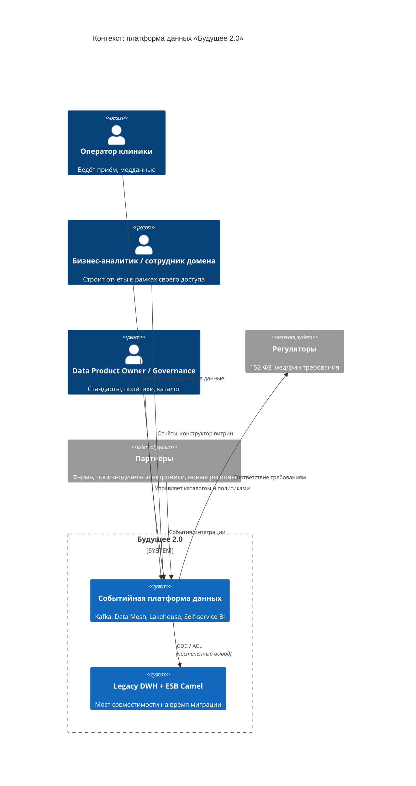
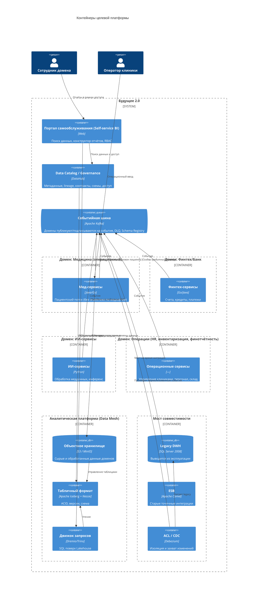
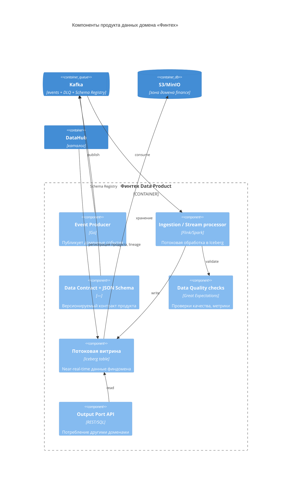

# Task 1. Целевая архитектура «Будущее 2.0» через год — C4-модель

Целевое состояние: слабосвязанная событийная платформа. Домены взаимодействуют через
события (Kafka) и реактивные потоки. Legacy DWH (SQL Server) и шина Camel остаются только
как «мосты совместимости» с антикоррупционными слоями (ACL) на время миграции. Аналитика
строится по модели Data Mesh поверх Data Lakehouse, доступ для бизнеса — через портал
самообслуживания (Self-service BI). Медкарты, истории болезни и снимки в аналитическую
витрину не попадают.

## Уровень 1 — Context

## Уровень 2 — Container

## Уровень 3 — Component (домен Финтех как пример продукта данных)

## Как изменятся ключевые системы за год

| Сейчас | Через год |
|---|---|
| Монолитный DWH (SQL Server 2008) с бизнес-логикой | DWH → мост совместимости (CDC), бизнес-логика вынесена в домены; цель — вывод из эксплуатации |
| ESB Camel как центр синхронных интеграций | Kafka + событийная интеграция; Camel только как ACL-мост |
| Power BI поверх кастомизаций DWH | Портал самообслуживания (Self-service BI) поверх Data Mesh |
| Единая команда хранилища = «бутылочное горлышко» | Доменные команды владеют своими продуктами данных |
| Batch-отчётность (часы) | Near-real-time потоковые витрины |
| Новые направления тяжело подключать | Новый домен = новый продукт данных + подписки на события |
