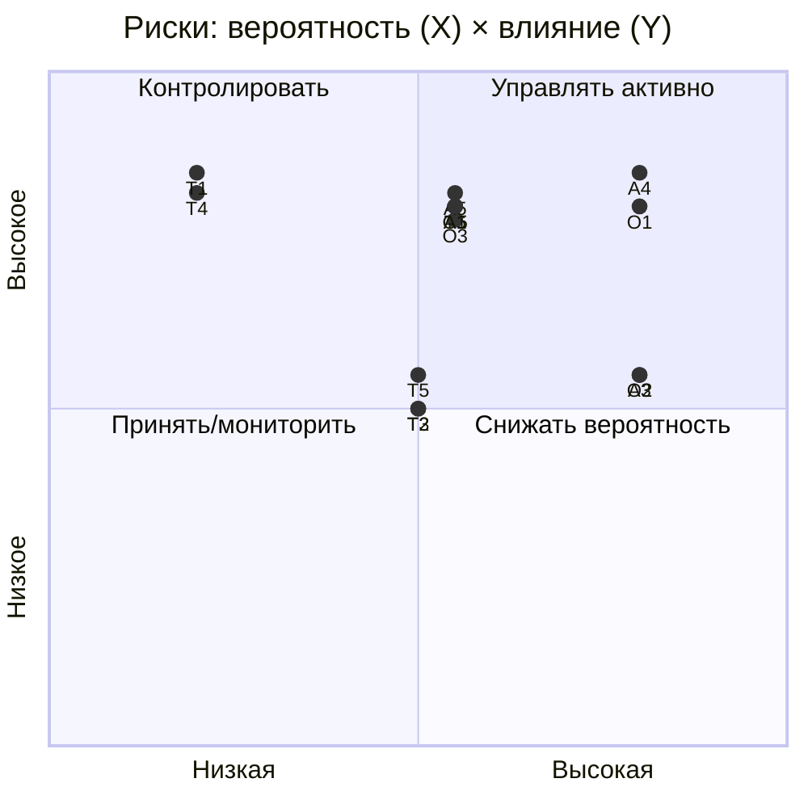

# Карта рисков трансформации

Вероятность: низкая / средняя / высокая. Влияние на бизнес: низкое / среднее / высокое.

## Архитектурные риски

| # | Риск | Вероятность | Влияние |
|---|---|---|---|
| A1 | Распределённый монолит вместо Data Mesh (домены остаются жёстко связаны через события) | Средняя | Высокое |
| A2 | Несогласованность данных без транзакций/контрактов между доменами | Средняя | Высокое |
| A3 | Дублирование данных и логики между доменными продуктами | Высокая | Среднее |
| A4 | Зависание DWH/Camel как «вечного» моста, миграция не завершается | Высокая | Высокое |
| A5 | Eventual consistency ломает сценарии, требующие строгой согласованности (финансы) | Средняя | Высокое |

## Организационные риски

| # | Риск | Вероятность | Влияние |
|---|---|---|---|
| O1 | Нехватка экспертизы по Data Mesh / Kafka / Iceberg на рынке | Высокая | Высокое |
| O2 | Сопротивление переходу от централизованного владения данными к доменному | Высокая | Среднее |
| O3 | Размывание ответственности за данные (нет Data Product Owner) | Средняя | Высокое |
| O4 | «Аренда» инженеров между доменами → нарушение границ доменов | Средняя | Среднее |
| O5 | Выгода не сразу → потеря поддержки бизнеса в середине пути | Средняя | Высокое |

## Технологические риски

| # | Риск | Вероятность | Влияние |
|---|---|---|---|
| T1 | Утечка/несоблюдение требований по мед- и финданным (152-ФЗ) | Низкая | Высокое |
| T2 | Vendor lock-in облачного провайдера | Средняя | Среднее |
| T3 | Сложность настройки Lakehouse/Data Mesh → низкая надёжность на старте | Средняя | Среднее |
| T4 | Потеря данных при миграции из legacy SQL Server | Низкая | Высокое |
| T5 | Деградация производительности near-real-time при росте источников | Средняя | Среднее |
| T6 | Потеря сообщений в Kafka без DLQ/идемпотентности | Средняя | Высокое |

## Тепловая карта (вероятность × влияние)

