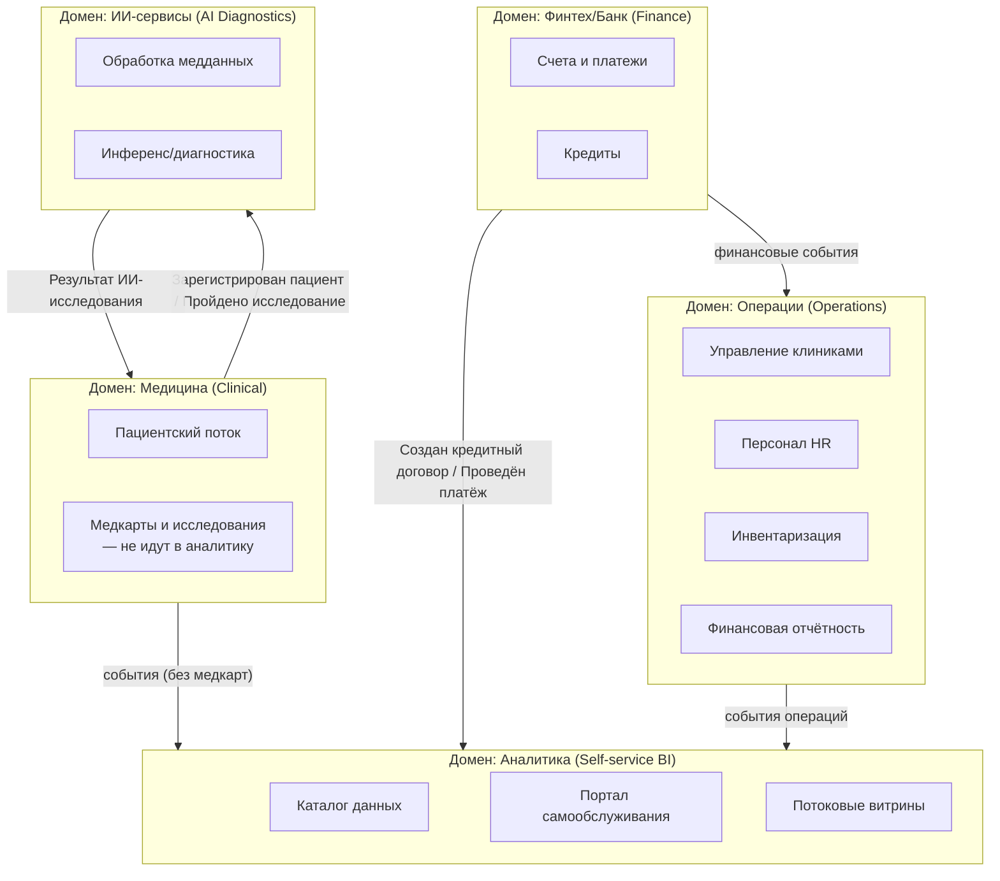

# Bounded Contexts — «Будущее 2.0»

Разделение системы на домены по DDD. Каждый bounded context владеет своими данными
и публикует контракт (output port) для других доменов. Интеграция — через события.

## Карта контекстов (отношения)

| Upstream → Downstream | Паттерн интеграции |
|---|---|
| Medical → AI | Customer/Supplier, события + контракт |
| AI → Medical | Published Language (результат исследования) |
| Все домены → Analytics | Open Host Service / события (продукты данных) |
| Legacy DWH/Camel → домены | Anti-Corruption Layer (ACL) на время миграции |
| Fintech → Ops | Conformist по финотчётности |

## Принадлежность данных к доменам

- **Medical:** пациенты, медкарты, истории болезни, снимки, исследования.
  В аналитическую витрину передаются только обезличенные операционные события,
  **без** медкарт/снимков/результатов исследований.
- **Finance:** счета, кредиты, платежи, финансовая история.
- **AI:** модели, прогоны инференса, метаданные исследований.
- **Operations:** клиники, персонал, инвентаризация, финансовая отчётность.
- **Analytics:** каталог, продукты данных, витрины (только разрешённые данные).
