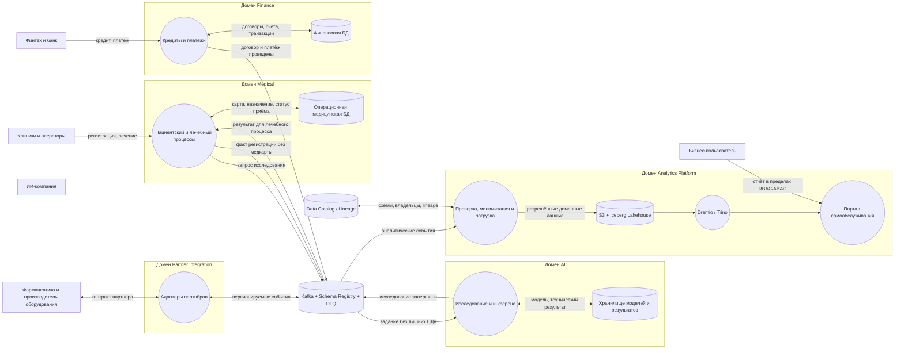

# Data Flow Diagram целевой архитектуры

Граница аналитики принимает только разрешённые события и атрибуты. Медицинские
карты, истории болезни и содержимое исследований остаются в домене Medical и в
аналитическую витрину не передаются.
