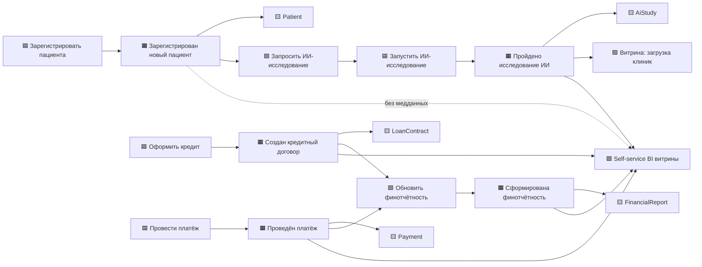

# Event Storming — целевая событийная архитектура

Легенда: 🟧 событие (факт) · 🟦 команда · 🟨 агрегат · 🟩 политика/реакция · 🟪 read-model.

## Источники и подписчики событий

| Событие | Источник (домен) | Подписчики |
|---|---|---|
| Зарегистрирован новый пациент | Medical | AI, Analytics |
| Пройдено исследование ИИ | AI | Medical, Analytics |
| Создан кредитный договор | Finance | Operations (финотчётность), Analytics |
| Проведён платёж | Finance | Operations, Analytics |
| Сформирована финотчётность | Operations | Analytics |

Все события проходят через Kafka со Schema Registry; необработанные сообщения уходят в DLQ.
