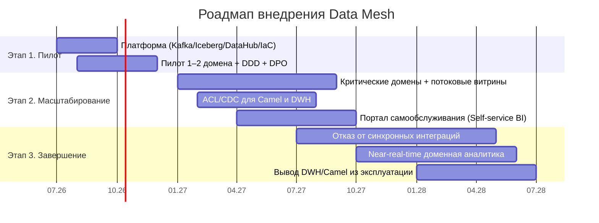

# Стратегический роадмап внедрения Data Mesh

## Ключевые роли
| Роль | Зона ответственности |
|---|---|
| **Data Product Owner** | Владелец продукта данных домена: контракт, качество, доступность, дорожная карта |
| **Data Engineer** | Пайплайны, потоки (Kafka/Flink), Iceberg-таблицы, IaC |
| **BI-аналитик** | Витрины, отчёты, портал самообслуживания, требования бизнеса |
| **Data Governance / Platform** | Каталог, политики, схемы, RBAC, единая инфраструктура |

## Ответственность и ресурсы по этапам

| Этап | Ожидаемый результат | Ответственные | Основные ресурсы |
|---|---|---|---|
| 0–6 месяцев | Согласована архитектура, определены домены, запущены 1–2 продукта данных | Архитектурный комитет, Platform Team, владельцы Medical и Finance | 2 data engineer, 2 backend engineer, DevOps/SRE, архитектор, Data Product Owner; Kafka, S3, Iceberg, DataHub |
| 6–12 месяцев | Работает портал самообслуживания и потоковые витрины критичных доменов | Analytics Platform, доменные команды, Data Governance | BI-команда, data engineer по доменам, специалист ИБ; Dremio/Trino, каталог, RBAC/ABAC |
| 12–18 месяцев | Подключаются партнёры и новые регионы без изменений общей DWH-логики | Partner Integration и доменные команды | API/event engineers, Schema Registry, контрактное тестирование, наблюдаемость |
| 18–36 месяцев | Основные потоки выведены из DWH/Camel, legacy отключается по критериям | Platform Team, SRE, владельцы legacy и доменов | CDC, архивное хранилище, средства сверки, нагрузочное тестирование и план отката |

## Этапы (привязка к бизнес-целям и этапам трансформации из ТЗ)

### Этап 1. Пилот (0–6 мес.) — промежуточное состояние
- Внедрить событийную интеграцию в 1–2 доменах (финансовые расчёты / пациентский поток).
- Единые принципы: события, очереди DLQ, каталог схем (Schema Registry).
- Развернуть платформу: Kafka, S3/MinIO, Iceberg+Nessie, DataHub, Terraform/CI-CD.
- Определить границы доменов (DDD) и назначить Data Product Owner.
- **Бизнес-цель:** доказать модель, сократить time-to-market на пилоте.

### Этап 2. Масштабирование (6–18 мес.)
- Расширение на критические домены; запуск потоковых витрин.
- Антикоррупционные слои (ACL) для интеграций через Camel и DWH (CDC/Debezium).
- Портал самообслуживания для бизнес-пользователей.
- **Бизнес-цель:** финальное состояние — пользователи доменов работают с данными в новой
  архитектуре; legacy временно сохраняется в отдельных доменах.

### Этап 3. Завершение (18–36 мес.) — долгосрочная цель
- Отказ от точечных синхронных интеграций на критическом пути.
- Доменная аналитика на потоках; переход batch → near-real-time.
- Вывод DWH/Camel из роли мостов.
- Поддержка масштабирования: новые продукты (финтех/мед/ИИ), 2–3 региона, рост источников.
- **Бизнес-цель:** слабосвязанная событийная платформа, домены через события и реактивные потоки.

## Диаграмма (Gantt)

