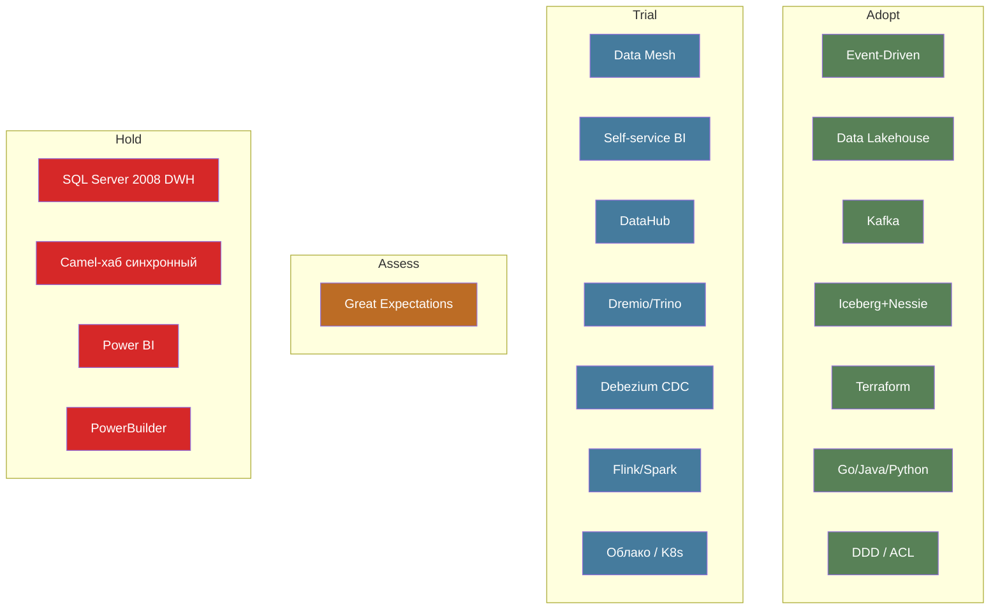

# Расширенный технический радар — «Будущее 2.0»

Включает технологии и архитектурные паттерны. Статусы: **Adopt** (активно используем),
**Trial** (пробуем на реальных задачах), **Assess** (изучаем), **Hold** (выводим/не для новых проектов).

## Квадрант: Архитектурные паттерны
| Паттерн | Статус | Комментарий |
|---|---|---|
| Event-Driven Architecture | Adopt | Базис целевой платформы |
| Data Mesh | Trial | Пилот в 1–2 доменах, затем масштабирование |
| Self-service BI | Trial | Портал самообслуживания поверх Lakehouse |
| Data Lakehouse | Adopt | Хранилище + Iceberg |
| Anti-Corruption Layer (мост к DWH/Camel) | Adopt | На время миграции |
| Domain-Driven Design | Adopt | Деление на домены |
| Centralized DWH с бизнес-логикой | Hold | Выводим из эксплуатации |
| Синхронная ESB-интеграция (Camel-хаб) | Hold | Только как мост |

## Квадрант: Языки и фреймворки
| Технология | Статус |
|---|---|
| Go (финтех-сервисы) | Adopt |
| Java (финтех/мед) | Adopt |
| Python (ИИ-сервисы) | Adopt |
| Apache Flink / Spark (стрим-процессинг) | Trial |
| PowerBuilder | Hold |

## Квадрант: Платформы
| Технология | Статус |
|---|---|
| Apache Kafka (+ Schema Registry, DLQ) | Adopt |
| S3 / MinIO (объектное хранилище) | Adopt |
| Apache Iceberg + Nessie | Adopt |
| Облако (IaaS/PaaS, 152-ФЗ) | Trial |
| Kubernetes | Trial |
| SQL Server 2008 (DWH) | Hold |

## Квадрант: Инструменты
| Технология | Статус |
|---|---|
| Terraform (IaC) | Adopt |
| DataHub (каталог/governance) | Trial |
| Dremio / Trino (query engine) | Trial |
| Debezium (CDC из legacy) | Trial |
| Great Expectations (data quality) | Assess |
| Power BI | Hold |

## Визуализация (по кольцам)

